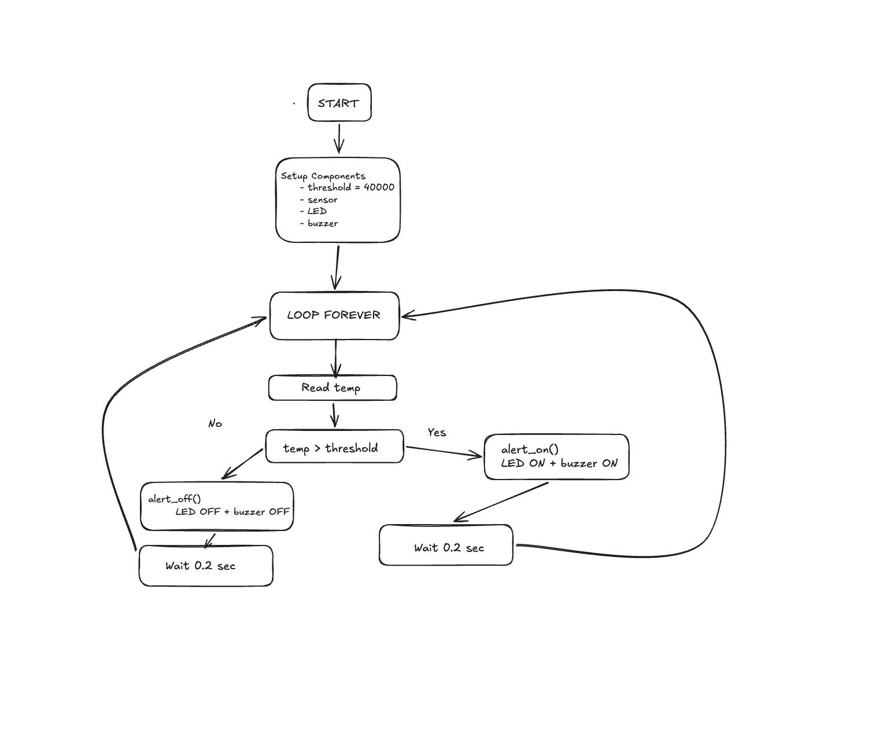

# Aarav_Rangi-9CT-TASK-2

Assessment Task 2

## Problem

Gaming PCs and school computers get very hot when running heavy games or programs. If a cooling fan breaks or gets blocked by dust, the computer can overheat. This causes the computer to slow down, crash suddenly, or even break permanently. Users often do not realize their PC is overheating until it is too late.

## Solution

I will build a PC Overheating Alert System using a Raspberry Pi Pico to solve this problem. 

### How It Works:
* The Sensor: A digital temperature sensor will be placed near the computer's exhaust fan to measure the hot air coming out.
* The Controller: The Raspberry Pi Pico will check the temperature sensor every second.
* The Alarm: If the air gets too hot (above 40°C), the Pico will automatically flash a bright Red LED and make a loud beeping sound with a Piezo Buzzer. 

This gives the user an immediate warning so they can save their work, turn off the computer, and fix the cooling problem before anything breaks.

### Functional Requirements
* The system must read an input value from a sensor (potentiometer acting as temperature).

* The system must activate a red LED when overheating is detected.

* The system must activate a buzzer when overheating is detected.

* The system must turn off the LED and buzzer when temperature returns to safe levels.

* The system must continuously monitor the sensor in a loop.

* The system must print sensor values for testing and debugging.

### Non‑Functional Requirements
*The system must respond quickly (under 2 seconds).

* The system must be easy to assemble on a breadboard.

* The system must be reliable and run without crashing.

* The system must be safe to operate with low‑voltage components.

* The code must be simple, readable, and well‑commented.

* The system must be small enough to sit next to a PC or laptop.

## Key Actions

- Detect the current “temperature” level using a potentiometer.
- Compare the sensor value to a preset threshold.
- Turn on a red LED when overheating is detected.
- Activate a buzzer when overheating is detected.
- Turn off the LED and buzzer when temperature returns to safe levels.

## Test Cases

| Test Case            | Input                                 | Expected Output                         |
|----------------------|----------------------------------------|------------------------------------------|
| Temperature normal   | Potentiometer below threshold          | LED off, buzzer off                      |
| Temperature high     | Potentiometer above threshold          | LED on, buzzer on                        |
| Rapid change         | Potentiometer quickly turned high/low  | LED/buzzer respond within 2 seconds      |
| Debug output         | Any potentiometer value                | Console prints current sensor reading    |

## Pseudocode

START

SET threshold to 40000
SET sensor to ADC pin 26
SET LED to output pin 15
SET buzzer to output pin 14

LOOP FOREVER
    READ the current temperature value
    IF temperature is above threshold THEN
        CALL alert_on
    ELSE
        CALL alert_off
    ENDIF
    WAIT 0.2 seconds
ENDLOOP

END
### Subroutine pseudo code

FUNCTION read_temperature
    READ value from sensor (ADC 26)
    RETURN the value
END FUNCTION

FUNCTION check_overheating
    CALL read_temperature and STORE result as temp
    PRINT temp to console

    IF temp is greater than threshold THEN
        CALL alert_on
    ELSE
        CALL alert_off
    ENDIF
END FUNCTION

## Program Explanation
This project is a temperature warning system that uses a Pico, a sensor, an LED, and a buzzer. The whole idea is that the Pico keeps checking the temperature over and over, and if it gets too hot, it turns on the LED and buzzer to warn you. If the temperature is normal, it keeps them off.

First, the Pico sets everything up, like the threshold number and which pins the LED and buzzer are connected to. Then it goes into a loop that never stops. Inside the loop, it reads the temperature from the sensor. After that, it checks if the temperature is bigger than the threshold. If it is, the alert turns on. If it’s not, the alert turns off. It waits 0.2 seconds so it doesn’t go super fast, and then it loops again.

It’s basically a simple safety system that tells you when things get too hot.

## How the Code Works
The code starts by setting up the sensor and the output pins. Then it makes a threshold value, which is the number the temperature has to pass before the alarm turns on. After that, the code goes into a loop that never ends.

Inside the loop, the Pico reads the temperature using the ADC pin. Then it checks if the temperature is higher than the threshold. If it is, it runs alert_on(), which turns the LED and buzzer on. If the temperature is lower, it runs alert_off(), which turns them off. After each check, the code waits 0.2 seconds so the Pico doesn’t spam the sensor too fast.

It’s basically just checking, deciding, and reacting over and over.

## Testing
To test the project, I tried different temperature values to see if the LED and buzzer reacted properly. When I made the temperature go above the threshold, the LED and buzzer turned on like they were supposed to. When the temperature stayed below the threshold, they stayed off.

I also tested the delay to make sure the Pico wasn’t switching too fast. Everything worked the way I expected. The alert turned on and off at the right times, and the loop kept running without crashing.

## Reflection
I learned a lot from this project, especially how sensors and microcontrollers work together. At first, it was confusing to understand how the ADC reading turned into a temperature, but after practicing it made more sense. The wiring was a bit annoying because the buzzer and LED had to be connected properly or nothing worked.

If I did this again, I’d probably add a screen so you can actually see the temperature instead of guessing. I’d also maybe add more alerts or make the buzzer beep instead of just staying on. But overall, I think it turned out pretty good and I understand how the whole system works now.

# PMIS

## pmi Mrigraank
When I looked at your temperature alert system, I think the good part is that it works pretty simply and I could understand what you were trying to do. The LED and buzzer turning on when it gets too hot is a clear idea and it makes sense. One minus is that some parts of your explanation were a bit confusing and I had to read it twice to get what you meant. Also the buzzer might be too loud and kinda annoying if someone uses it for real. Something interesting  is that the Pico keeps looping forever, but honestly it’s just doing the same thing over and over.

## pmi alfonso
When I checked your code, the plus is that it’s not too hard to follow and the functions make it a bit easier to read. The loop is basic but it does what it needs to do. A minus is that you could add more comments because some parts feel a bit empty and I wasn’t totally sure why you picked certain numbers. Also the sensor reading part looks kinda messy and might confuse someone who hasn’t used ADC before. Something interesting is that the code reacts pretty fast, but it just works how it’s supposed to.

## pmi pradhyot
Your documentation is mostly fine and the flowchart helps a bit with understanding what’s going on which is the plus. A minus is that some of the writing feels rushed and there are spots where you could explain things more clearly. Also maybe adding a picture of your wiring would help because I couldn’t really imagine how you set it up. Something interesting is that your reflection shows you learned stuff, but it’s not super detailed and kinda short, so it doesn’t stand out that much.

# Conclusion
This project worked the way it was supposed to. The Pico could read the potentiometer and turn the LED and buzzer on when the value went past the threshold. I learned how to use inputs and outputs properly, and even though some parts were annoying, I still got it finished. If I did it again, I’d probably add more features, but overall I think the project turned out fine and does what it was meant to do.